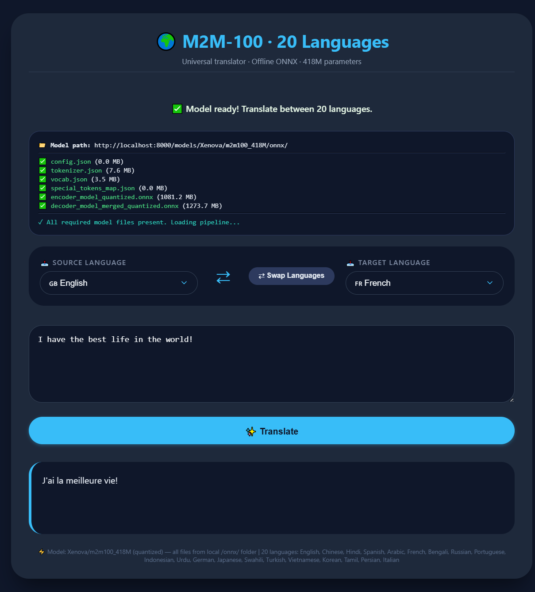

# 🌍 M2M-100 Offline Translator – 20 Major Languages
<div align="center">


</div>



> 100% client‑side translation | No API keys | Runs locally with ONNX runtime

Translate between 20 of the world’s most spoken languages using Facebook’s **M2M-100 (418M)** model, quantized and optimised for the browser. All processing happens inside your computer – zero data leaves your device.

Live demo? Host the files on any HTTP server and use it completely offline.

---

## 🚀 Features

- **20 languages** – English, Chinese (Simplified), Hindi, Spanish, Arabic, French, Bengali, Russian, Portuguese, Indonesian, Urdu, German, Japanese, Swahili, Turkish, Vietnamese, Korean, Tamil, Persian, Italian.
- **True offline translation** – No external API, no tracking. The entire model (`onnx` quantized files) is served from your local machine.
- **Bidirectional** – Translate from any of the 20 languages to any other.
- **RTL support** – Automatically switches text direction for Arabic, Urdu, Persian.
- **Keyboard shortcut** – `Ctrl+Enter` (or `Cmd+Enter`) to translate quickly.
- **Lightweight UI** – Responsive dark theme, works on desktop & tablet.
- **Swap languages** – Button to flip source and target instantly.

---

## 🧠 How It Works

This project uses the [`@huggingface/transformers`](https://huggingface.co/docs/transformers.js) library with the **ONNX WebAssembly** backend.  
The model – `Xenova/m2m100_418M` – is taken from Hugging Face, quantized, and served locally.  
No request is ever sent to a remote server; the `env.resolveFile` override forces all `.json` and `.onnx` files to be fetched from your own local path.

---

## 📦 Requirements

- A local HTTP server (because browsers restrict `file://` from loading `.onnx` files)
- The quantised ONNX model files placed at the expected URL (see Setup)
- Modern browser with WebAssembly support (Chrome, Firefox, Edge, Safari)

---

## ⚙️ Setup & Usage

### 1. Download the model files

First you need the quantized ONNX files for `Xenova/m2m100_418M`.  
You can obtain them by:

- Running the conversion script from Hugging Face Transformers.js, or  
- Downloading a pre‑built set (not included in this repo for size reasons).

Typical required files:
```
config.json
tokenizer.json
vocab.json
special_tokens_map.json
encoder_model_quantized.onnx
decoder_model_merged_quantized.onnx
```

### 2. Serve the model folder

Place all those files inside a folder, for example:
```
/your-server/models/Xenova/m2m100_418M/onnx/
```

Then start an HTTP server from the root of that folder.  
Examples:
```bash
# with Python
python -m http.server 8000

# with Node.js (http-server)
npx http-server -p 8000
```

### 3. Configure the HTML file

Open `index.html` (the translator interface) and adjust the `MODEL_BASE_PATH` constant to match your server URL:
```js
const MODEL_BASE_PATH = 'http://localhost:8000/models/Xenova/m2m100_418M/onnx/';
```

### 4. Open the page

Navigate to `http://localhost:8000` (or wherever you host the HTML file).  
The interface will check for all required files, load the model (first load takes 20‑40 seconds), and then you can start translating.

---

## 🛠️ Technical Details

| Component         | Technology                                                                 |
|-------------------|----------------------------------------------------------------------------|
| Translation model | M2M-100 418M (multilingual encoder‑decoder)                                |
| Runtime           | ONNX Runtime (WASM) via Transformers.js                                    |
| Language codes    | ISO 639-1 (en, zh, hi, es, ar, fr, bn, ru, pt, id, ur, de, ja, sw, tr, vi, ko, ta, fa, it) |
| RTL languages     | Arabic (`ar`), Urdu (`ur`), Persian (`fa`)                                  |

The pipeline is instantiated with:
```js
await pipeline('translation', 'Xenova/m2m100_418M', {
    device: 'wasm',
    local_files_only: true,
    use_fp16: false
});
```

---

## 🖼️ Screenshot


*The translator with language selection, input area, and result panel.*

---

## 🌐 Related Tools & Credits

This project is part of a larger collection of **free online tools** (unit converter, colour picker, password generator, QR code reader/creator, and more) maintained by **[toolshed.click](https://toolshed.click)**.

Visit [https://toolshed.click](https://toolshed.click) for dozens of other handy utilities – all client‑side, no ads, no tracking.

---

## 📄 License

MIT – you are free to use, modify, and distribute this software.

---

## 🙏 Acknowledgements

- [Facebook Research](https://github.com/facebookresearch/fairseq/tree/main/examples/m2m_100) for the M2M-100 model.
- [Hugging Face](https://huggingface.co/) for Transformers.js and the ONNX export.
- [Xenova](https://huggingface.co/Xenova) for the quantised conversion.

---

*Built with ❤️ for offline, private, multilingual translation.*
